<a href="assets/profile.svg#gh-light-mode-only">
  <picture>
    <source media="(max-width: 600px)" srcset="assets/profile-mobile.svg">
    
  </picture>
</a>
<a href="assets/profile-dark.svg#gh-dark-mode-only">
  <picture>
    <source media="(max-width: 600px)" srcset="assets/profile-dark-mobile.svg">
    
  </picture>
</a>
