<picture>
  <source media="(max-width: 600px) and (prefers-color-scheme: dark)" srcset="assets/profile-dark-mobile.svg">
  <source media="(max-width: 600px)" srcset="assets/profile-mobile.svg">
  <source media="(prefers-color-scheme: dark)" srcset="assets/profile-dark.svg">
  
</picture>
